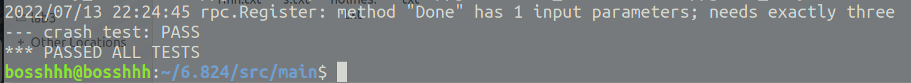

# 6.824
MIT 6.824 try to work it out!

## lab1
运行命令：
```shell
go build -race -buildmode=plugin ../mrapps/wc.go
rm mr-out*
go run -race mrcoordinator.go pg-*.txt
# another terminal
go run -race mrworker.go wc.so
```
一开始以为是在worker里面启动多个go协程，后来看了测试脚本才明白：


## lab2

因为实习+某些原因，暂时得弃坑了，希望以后有机会能填完...

### 2A

差不多写完了
